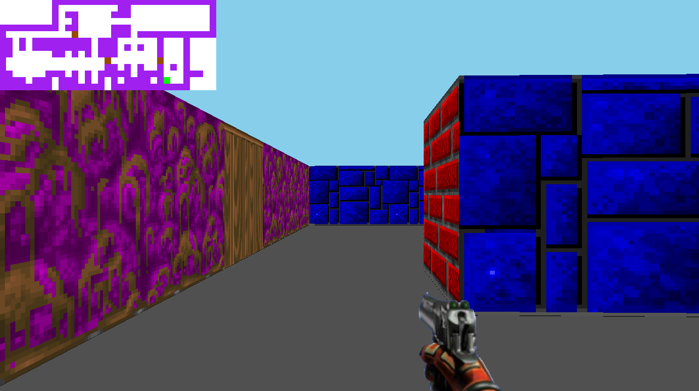

<h1 align="center">cub3D</h3>

    

This project is about developing a pseudo 3D Game using a Raycasting Algorithm in C.

---

    

---
### About this project
As visually appealing as this project is, I didn't like the way it is integrated into the common core, especially being a mandatory project (sure, you can choose MiniRT, but the situation only worsens). The reason for this is the project's algebraic and geometric load, which is too advanced for a student who doesn't have solid mathematical foundations (like myself). Having a project that involves mathematical knowledge is not the issue; the problem is that the common core didn’t require me to develop these mathematical foundations throughout the course (I did `so_long` previously, so no algebra content came my way), and suddenly, I have to learn linear algebra concepts to understand the raycasting algorithm.

Another aspect is that this graphics project didn't give me any fundamental knowledge (the game loop, events, frames, and pixel fundamentals I learned in the previous graphics project that I did, `so_long`), unlike other common core projects where, even though some may find them useless, system and Unix programming fundamentals are very essential. For some, the mathematics in this project will certainly be fundamental, but I believe that's not the case for the majority. But that's life, we don't always learn only what we want and enjoy. Cub3D was still a learning experience anyway!
